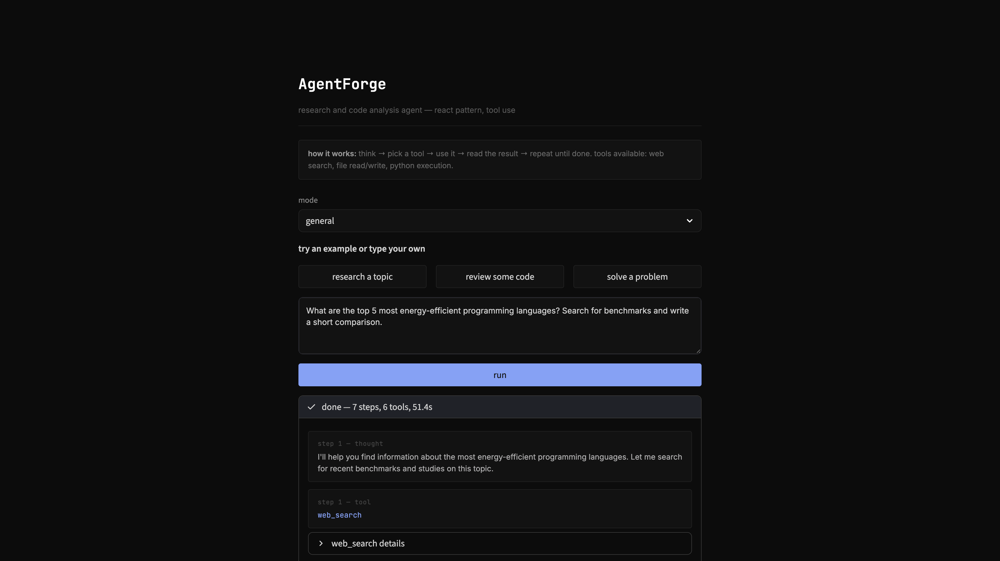

# AgentForge

A ReAct tool-use agent built with Python and the Claude API. It reasons through tasks step-by-step, decides which tools to use on its own, and delivers structured answers.

Built in two ways — from scratch in Python (high-code) and replicated in Dify (low-code) — to compare how different approaches handle the same agent design problem.

---

## Screenshots

**Web UI — task input and agent steps**



**Structured output from a completed run**


---

## What it does

Give it a task in plain English. It'll break it down, search the web, read files, write reports, or run code — whatever's needed — then come back with an answer.

It runs on the ReAct pattern:
```
think → pick a tool → use it → look at the result → think again → repeat → answer
```

## Tools

| Tool | What it does |
|------|-------------|
| `web_search` | DuckDuckGo search, no API key needed |
| `read_file` | Read local files (code, configs, docs) |
| `write_file` | Create files (reports, code, analysis) |
| `run_code` | Execute Python with a 30s timeout |

## Modes

- **General** — default, handles most tasks
- **Research** — multi-source research with synthesis
- **Code review** — code analysis with specific suggestions

Each mode swaps the system prompt to change how the agent approaches the task. Same tools, different behaviour.

## Setup

```bash
git clone https://github.com/PHM4/AgentForge.git
cd AgentForge
python3 -m venv venv
source venv/bin/activate
pip install -r requirements.txt

# add your API key
echo "ANTHROPIC_API_KEY=your-key" > .env
```

## Usage

**CLI:**
```bash
python -m agent.core
```

**Web UI:**
```bash
streamlit run app.py
```

**Run evals:**
```bash
python -m eval.test_cases
```

## Evaluation

The eval framework runs the agent against test cases and scores each run on:
- **Tool usage** (30%) — did it use the right tools?
- **Answer quality** (40%) — does the answer contain the expected info?
- **Efficiency** (30%) — did it finish in a reasonable number of steps?

Anything below 60/100 gets flagged as a bad case. Results are saved as JSON for analysis.

```
Running 2 test cases
[1/2] simple factual search
  [pass] 92.0/100 (tools:100 keywords:80 efficiency:100)
[2/2] code generation + execution
  [pass] 73.3/100 (tools:100 keywords:33.3 efficiency:100)

avg: 82.7/100 | bad cases: 0/2
```

## High-code vs low-code

| | Python (this repo) | Dify |
|---|---|---|
| Flexibility | full control | platform constraints |
| Build time | hours | minutes |
| Customisation | unlimited | template-based |
| Evaluation | custom scoring | platform metrics |
| Deployment | self-hosted | platform-hosted |
| Best for | complex/custom logic | rapid prototyping |

## Project structure

```
AgentForge/
├── agent/
│   ├── core.py          # the react loop
│   ├── tools.py         # tool schemas + implementations
│   └── prompts.py       # system prompts per mode
├── eval/
│   ├── test_cases.py    # eval framework
│   └── results/         # scored runs (auto-generated)
├── app.py               # streamlit web ui
├── requirements.txt
└── README.md
```

## Tech

- Python, Claude API (Anthropic), Streamlit, DuckDuckGo search
- Dify for the low-code comparison build

---

Built by [PHM4](https://phm4.co.uk)
